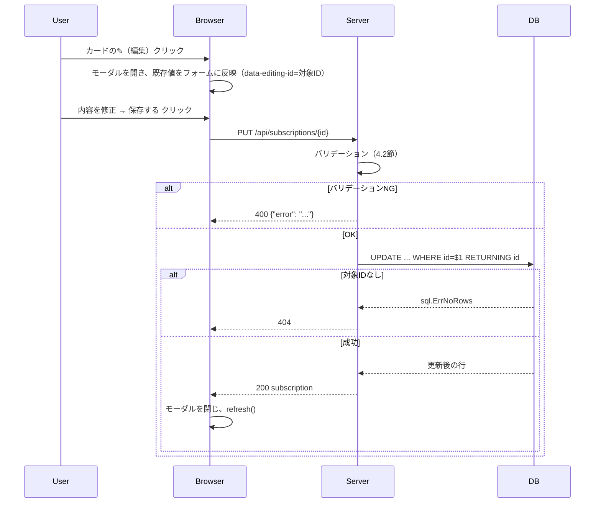
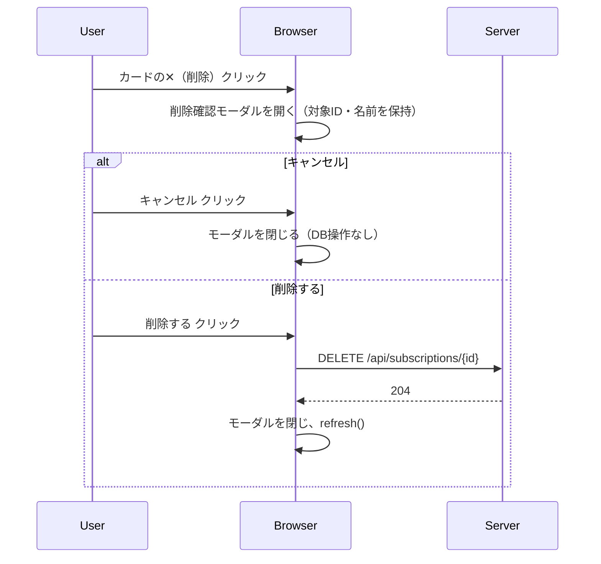
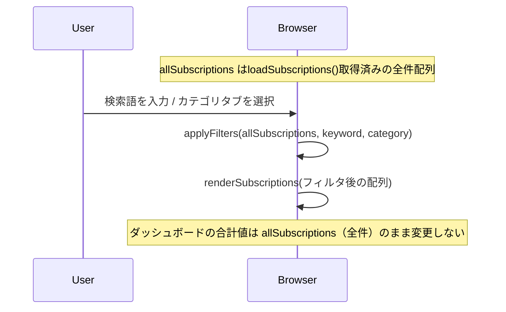
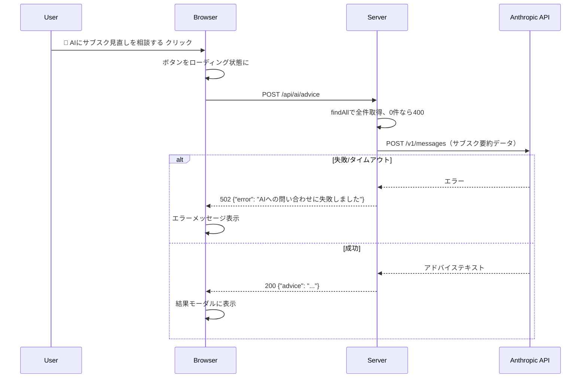

# PocketSub 追加設計書 v2（機能ブラッシュアップ）

本書は [design.md](./design.md)（初版設計書）に対する**追加・変更差分の設計書**である。今回追加する6つの改善（カテゴリ・支払い周期の視覚化／削除確認モーダル／検索・フィルター／AI提案／データ・UI品質向上／高度なUI・UX改善）について、現状コードとの差分を明示した上で、実装可能なレベルまで詳細化する。

本書はまだ**設計フェーズの成果物**であり、実装はこの内容のレビュー・合意後に着手する。

対象プロジェクト: **PocketSub**（Go 標準ライブラリ `net/http` + PostgreSQL + Tailwind CSS + 素のJavaScript）。バックエンドはFastAPIではなくGoである点に注意（要件メモに誤記があったため本書冒頭で明記する）。

## 目次

1. 要件の整理（統合版）
2. 現状コードとの差分サマリ
3. データベース設計変更
4. バックエンド設計変更
5. フロントエンド設計変更
6. シーケンス設計
7. 影響範囲・移行手順
8. 未確定事項（要ユーザー確認）

---

## 1. 要件の整理（統合版）

ユーザーから2回に分けて提示された要件を1つに統合し、重複・上書き関係を整理する。

| # | 機能 | 詳細 |
|---|---|---|
| 1 | カテゴリ表示・支払い周期の視覚化 ＋ モーダルUX改善 | ①`subscriptions`テーブルに`category`カラム追加 ②登録・編集モーダルの「サービス名」直下にカテゴリ選択プルダウンを追加 ③「料金（円）」欄にプレースホルダー（例: `980`）を表示 ④「次回更新日」欄に今日の日付をデフォルト値としてセット ⑤カードUIに「月額」/「年額」バッジを目立つように表示 |
| 2 | 削除確認モーダル | カード✕ボタン押下時に即時削除せず、「本当にこのサブスクを削除しますか？」の確認モーダルを表示し、承認後にのみ削除する |
| 3 | 検索・フィルター機能 | サービス名で絞り込む検索バー、カテゴリで絞り込むフィルター（タブ等）を画面上部に追加 |
| 4 | AI提案機能（Claude API） | ダッシュボードに「🤖 AIにサブスク見直しを相談する」ボタンを配置。クリック時に登録中のサブスクデータをClaude APIに送信し、支出見直しのアドバイスを表示する |
| 5 | データ・表示品質の向上 | カテゴリ等の表記ゆれ防止（固定選択肢化）、UI全体のデザインをモダンに洗練させる |
| 6 | 高度なUI/UX改善（プロダクト完成度向上） | ①ダッシュボードに「今月の月額換算合計コスト」カードを追加 ②一覧に並び替え（料金が高い順/安い順、次回更新日が近い順、名前順）のセレクトボックスを追加 ③サービス名からブランド系絵文字/アイコンを自動推測してカードに表示 ④追加・編集・削除・AI提案実行時にトースト通知を表示する |

> **設計上の補足**: 項目1の要件文には「登録・**編集**フォーム」「登録・**編集**モーダル」という記述がある。現行のPocketSubには編集（Update）機能が存在しない（`List`/`Create`/`Delete`/`Summary`のみ）。この記述を字義通りに解釈し、本書では**編集機能の新規追加をスコープに含める**（8章で最終確認を求める）。

---

## 2. 現状コードとの差分サマリ

| ファイル | 現状 | 変更内容 |
|---|---|---|
| `internal/db/db.go` | `schema`定数に`category`列なし。`CREATE TABLE IF NOT EXISTS`のみ | `category`列を追加する`ALTER TABLE ... ADD COLUMN IF NOT EXISTS`文を追加し、既存テーブルへの後方互換マイグレーションとする（3.1節） |
| `internal/handlers/subsc.go` | `Subscription`構造体に`Category`なし。`List`/`Create`/`Delete`/`Summary`のみ。`create`/`findAll`のみ | ①`Category`フィールド追加 ②`Update`ハンドラー・`update`DBアクセス関数を新規追加 ③`name`のトリム処理追加 ④カテゴリのバリデーション追加（4.1〜4.2節） |
| `internal/handlers/advice.go`（新規） | 存在しない | Claude APIを呼び出す`POST /api/ai/advice`ハンドラーを新規作成（4.4節） |
| `internal/handlers/subsc.go`（`Summary`メソッド） | `total_annual_cost`/`subscription_count`のみ返す | `monthly_equivalent_cost`（今月の月額換算合計コスト）を追加（4.7節） |
| `cmd/pocket-sub/main.go` | ルーティングに`PUT`・AI系エンドポイントなし | `PUT /api/subscriptions/{id}`、`POST /api/ai/advice`のルーティング追加。`ANTHROPIC_API_KEY`の読み込み追加 |
| `.env.example` / `.env` | `DATABASE_URL`、`PORT`のみ | `ANTHROPIC_API_KEY`を追加 |
| `web/static/index.html` | 追加モーダルのみ（カテゴリ選択なし、確認モーダルなし、検索/フィルターUIなし、AI導線なし、日付デフォルト値なし、priceプレースホルダーなし、並び替えUIなし、トースト表示領域なし） | ①モーダルにカテゴリ選択欄・price placeholder・date初期値を追加 ②削除確認モーダルを新規追加 ③検索バー・カテゴリフィルタータブを新規追加 ④AI提案ボタン・結果表示モーダルを新規追加 ⑤カードテンプレートにcategoryバッジ・billing_cycleバッジ・自動アイコンを追加 ⑥「今月の月額換算合計コスト」カードを追加 ⑦並び替えセレクトボックスを追加 ⑧トースト通知用のコンテナ要素を追加 ⑨全体のデザイントークン調整（5.6節） |
| `web/static/js/app.js` | `renderSubscriptions`/`loadSubscriptions`/`loadSummary`/`deleteSubscription`/`refresh`/追加フォームsubmitのみ | ①`editSubscription`/編集フォームsubmit ②`openDeleteConfirm`/`confirmDelete`（即時`deleteSubscription`呼び出しを置き換え） ③`applyFilters`（検索語・カテゴリでのクライアントサイド絞り込み） ④`requestAiAdvice`/結果描画 ⑤カード内バッジ・アイコン描画ロジック追加 ⑥`sortSubscriptions`（並び替え） ⑦`showToast`（トースト通知） ⑧`guessIcon`（サービス名→絵文字マッピング） |
| `web/static/css/style.css` | フォント指定のみ | トースト通知のスライドイン/アウトの`@keyframes`アニメーションを追加。それ以外は必要に応じてTailwindで表現しきれない微調整（バッジのグラデーション等）を追加し、基本はTailwindクラスで完結させる方針を維持 |
| `docs/design.md` | v1のまま | 本書の内容が実装完了後、design.mdへ統合する運用とする（7章参照） |

---

## 3. データベース設計変更

### 3.1 `category` カラムの追加

```sql
ALTER TABLE subscriptions
    ADD COLUMN IF NOT EXISTS category TEXT NOT NULL DEFAULT 'その他';

ALTER TABLE subscriptions
    DROP CONSTRAINT IF EXISTS subscriptions_category_check;

ALTER TABLE subscriptions
    ADD CONSTRAINT subscriptions_category_check
    CHECK (category IN ('エンタメ', '音楽', 'アプリ', 'ツール', 'アーティスト', 'その他'));
```

`internal/db/db.go`の`Migrate`関数内で、既存の`CREATE TABLE IF NOT EXISTS`実行後にこの`ALTER TABLE`群を続けて実行する。`ADD COLUMN IF NOT EXISTS`とすることで、初回起動（テーブル未作成）・既存テーブルへの追加適用のどちらでも冪等に動作する（design.md 3.5節の「冪等なDDLのみを許可する」方針を踏襲）。

既存レコードには`DEFAULT 'その他'`が適用されるため、データ移行時に手動更新は不要。

### 3.2 カテゴリの固定リスト

表記ゆれ防止（5章の要件5）のため、`billing_cycle`と同様にDB側の`CHECK`制約で選択肢を固定し、フロントエンドのプルダウンと1対1で対応させる。

| カテゴリ値 | 表示ラベル |
|---|---|
| `エンタメ` | 動画配信・電子書籍等 |
| `音楽` | 音楽ストリーミング |
| `アプリ` | 生産性ツール・スマホアプリ |
| `ツール` | 開発ツール・SaaS |
| `アーティスト` | 推し・ファンクラブ課金 |
| `その他` | 上記に当てはまらないもの |

> カテゴリの語彙自体は運用しながら調整可能（8章の確認事項）。

### 3.3 `name`列の表記ゆれ対策

カテゴリはプルダウン化により表記ゆれが構造的に発生しないが、`name`（サービス名）は自由入力のため、最低限のノーマライズとしてサーバー側で前後の空白を除去する（`strings.TrimSpace`）。大文字小文字・カタカナ/英語表記の統一までは行わない（例:「Netflix」と「ネットフリックス」を同一視するような名寄せは、要件のスコープ外かつ判定ロジックが複雑になるため見送る）。

---

## 4. バックエンド設計変更

### 4.1 `Subscription`構造体の拡張

```go
type Subscription struct {
    ID               int64     `json:"id"`
    Name             string    `json:"name"`
    Category         string    `json:"category"`
    Price            int       `json:"price"`
    BillingCycle     string    `json:"billing_cycle"`
    NextBillingDate  time.Time `json:"next_billing_date"`
    CreatedAt        time.Time `json:"created_at"`
    AnnualCost       int       `json:"annual_cost"`
    DaysUntilRenewal int       `json:"days_until_renewal"`
}

var validCategories = map[string]bool{
    "エンタメ":   true,
    "音楽":     true,
    "アプリ":    true,
    "ツール":    true,
    "アーティスト": true,
    "その他":    true,
}
```

`findAll`のSELECT文・`create`のINSERT文に`category`カラムを追加する。

### 4.2 バリデーションルールの追加・変更

| 対象 | 条件 | 違反時 |
|---|---|---|
| category | `validCategories`に含まれる値であること | `400` `"カテゴリの指定が不正です"` |
| name | トリム後に空文字でないこと（既存ルールを維持しつつ`strings.TrimSpace`適用後に判定） | `400` `"サービス名と料金は必須です"`（既存メッセージ維持） |

### 4.3 CRUD拡張: `Update`（編集機能の新規追加）

```go
func (h *SubscriptionHandler) Update(w http.ResponseWriter, r *http.Request)
func (h *SubscriptionHandler) update(ctx context.Context, id int64, s Subscription) (Subscription, error)
```

**ルーティング**: `PUT /api/subscriptions/{id}`

**リクエストボディ**（`Create`と同形式 + `category`）
```json
{
  "name": "Netflix",
  "category": "エンタメ",
  "price": 1490,
  "billing_cycle": "monthly",
  "next_billing_date": "2026-09-25"
}
```

**処理フロー**:
1. パスパラメータ`id`をパース（不正なら`400`）
2. リクエストボディをバリデーション（4.2節・既存の`Create`と同一ルールを共有する。バリデーション処理を`validateSubscriptionInput`として関数抽出し、`Create`と`Update`で共有する ── 重複実装を避けるための唯一のリファクタリング）
3. `UPDATE subscriptions SET name=$1, category=$2, price=$3, billing_cycle=$4, next_billing_date=$5 WHERE id=$6` を実行
4. 対象IDが存在しない場合は`sql.ErrNoRows`相当の判定を行い`404` `"指定されたサブスクリプションが見つかりません"`を返す（`RETURNING id`句を使い、`QueryRowContext`の`Scan`が`sql.ErrNoRows`を返すかで判定する）
5. 成功時は更新後の内容を`withComputedFields`で計算して`200`で返す

**レスポンス**:

| ステータス | 条件 |
|---|---|
| 200 | 更新成功。更新後のサブスク（`List`と同形式） |
| 400 | バリデーション違反 |
| 404 | 指定IDが存在しない |
| 500 | DBエラー |

### 4.4 AI提案機能（Claude API連携）

**新規ファイル**: `internal/handlers/advice.go`

**ルーティング**: `POST /api/ai/advice`（リクエストボディなし。サーバー側で現在の登録済みサブスク一覧を取得してから外部APIに渡す）

**処理フロー**:
1. `findAll`で全サブスクを取得
2. 0件の場合は`400` `"登録されているサブスクがありません"`を返す（API呼び出し前にガードし、無駄な外部通信を避ける）
3. 送信データを最小限の項目に絞って整形する（プライバシー・トークン削減の両面から、`id`や`created_at`等の内部情報は送らない）
   ```json
   [
     {"name": "Netflix", "category": "エンタメ", "price": 1490, "billing_cycle": "monthly", "annual_cost": 17880}
   ]
   ```
4. Anthropic Messages API（`https://api.anthropic.com/v1/messages`）を`model: "claude-sonnet-5"`で呼び出す。システムプロンプトで「日本語で、サブスクの見直し提案を簡潔に箇条書きで」等の出力形式を指定する
5. レスポンスのテキストを整形してクライアントに返す

**リクエスト/レスポンス（対クライアント）**:

成功レスポンス `200`
```json
{
  "advice": "・Netflixは年間換算17,880円です。視聴頻度が低い場合は年額プランへの切替や解約を検討しましょう。\n・..."
}
```

**エラーハンドリング**:

| ケース | ステータス | メッセージ |
|---|---|---|
| `ANTHROPIC_API_KEY`未設定 | 503 | `"AI提案機能は現在利用できません"` |
| 登録0件 | 400 | `"登録されているサブスクがありません"` |
| Anthropic API呼び出し失敗・タイムアウト（15秒） | 502 | `"AIへの問い合わせに失敗しました"` |

**設計判断の理由**:
- 外部APIキー（`ANTHROPIC_API_KEY`）は環境変数で管理し、フロントエンドには一切渡さない。クライアントは自前の`POST /api/ai/advice`のみを呼び出し、Anthropic APIへの直接アクセスは行わない（APIキー漏洩防止）。
- 専用のAnthropic SDKは導入せず、標準ライブラリの`net/http`でリクエストを組み立てる（design.mdの「標準ライブラリのみで完結させる」方針を維持し、依存を増やさない）。
- タイムアウトは`context.WithTimeout`で15秒に設定し、外部APIの遅延がサーバー全体をブロックしないようにする。

### 4.5 削除確認について

削除確認はUXの変更であり、`DELETE /api/subscriptions/{id}`のAPI仕様・実装（`internal/handlers/subsc.go`の`Delete`メソッド）に変更は不要。確認ダイアログの表示・キャンセル処理はすべてフロントエンド（5.3節）で完結させる。

### 4.6 起動処理（`main.go`）への追加

```go
mux.HandleFunc("PUT /api/subscriptions/{id}", subscriptionHandler.Update)
mux.HandleFunc("POST /api/ai/advice", subscriptionHandler.Advice)
```

`ANTHROPIC_API_KEY`は`DATABASE_URL`と異なり**必須にしない**（未設定でもサーバー自体は起動できるが、AI提案機能のみ4.4節のフォールバックで無効化される）。これによりAI機能を使わない開発者・レビュアーでもアプリ全体を問題なく動かせる。

### 4.7 「今月の月額換算合計コスト」の集計拡張

`summaryResponse`に`monthly_equivalent_cost`を追加する。

```go
type summaryResponse struct {
    TotalAnnualCost       int `json:"total_annual_cost"`
    MonthlyEquivalentCost int `json:"monthly_equivalent_cost"`
    SubscriptionCount     int `json:"subscription_count"`
}
```

**計算方法**: `monthly_equivalent_cost = round(total_annual_cost / 12)`（四捨五入。`math.Round(float64(total)/12)`）。

**設計判断**: 「今月の月額換算合計コスト」を、当月に実際に請求される金額（年額契約は契約月にのみ発生する）ではなく、**年間合計コストを12等分した平均月額**として定義する。実際の当月請求額（年額契約の更新月を考慮した計算）は、月をまたぐたびに金額が跳ねて分かりづらく、「今このペースで契約し続けるとひと月あたりいくらか」という直感的な指標のほうがダッシュボード表示に適するため。この解釈で問題なければ実装するが、"実際に今月請求される金額" が欲しい場合は8章で指摘してほしい（`billing_cycle='yearly'`かつ`next_billing_date`の月が当月と一致するものだけ加算する、という別ロジックになる）。

既存クライアントは未知のJSONフィールドを無視するため、後方互換性の問題はない。

---

## 5. フロントエンド設計変更

### 5.1 登録・編集モーダルの変更

```
┌ サブスクを追加 / 編集 ────────────┐
│ サービス名 [___________]         │
│ カテゴリ   [▼ エンタメ      ]    │ ← 新規（サービス名の直下）
│ 料金（円） [placeholder: 980]    │ ← placeholder追加
│ 支払いサイクル [▼ 月額]          │
│ 次回更新日 [2026-09-16(今日)]     │ ← デフォルト値=今日
│              [キャンセル][保存する] │
└──────────────────────────┘
```

- カテゴリの`<select>`は`billing_cycle`と同じ`<select>`要素とし、3.2節の6値をoptionとして列挙する。
- 追加/編集で同一モーダル・同一フォームを再利用する。フォームに隠しフィールド（例: `data-editing-id`）を持たせ、値が空なら`POST`（新規登録）、値があれば`PUT /api/subscriptions/{id}`（更新）に振り分ける。モーダルタイトルも「サブスクを追加」/「サブスクを編集」で出し分ける。
- `next_billing_date`のデフォルト値は、モーダルを開く瞬間にJSで`YYYY-MM-DD`形式の今日の日付をセットする（編集モーダルを開いた場合は対象データの日付で上書きする）。

### 5.2 カードUIの変更

```
┌─────────────────────────────┐
│ Netflix                  [✎][✕] │
│ [エンタメ]  [月額]              │ ← カテゴリバッジ + 周期バッジ
│ ¥1,490 /月                     │
│ 年間換算 ¥17,880                │
│ 2026-09-25          [あと9日]   │
└─────────────────────────────┘
```

- 周期バッジ: 「月額」は`bg-sky-100 text-sky-700`、「年額」は`bg-violet-100 text-violet-700`など、既存の更新日ステータス色（赤/黄/緑）と衝突しない色味を割り当てる。
- カテゴリバッジ: カテゴリごとに固定の色をマッピングする辞書をJS側に持つ（例: `{エンタメ: "bg-rose-100 text-rose-700", 音楽: "bg-indigo-100 text-indigo-700", ...}`）。
- 編集ボタン（✎）をカード右上、削除ボタン（✕）の隣に追加する。

### 5.3 削除確認モーダル（新規）

```
┌ サブスクを削除 ────────────┐
│ 「Netflix」を削除します。     │
│ この操作は取り消せません。     │
│         [キャンセル][削除する] │
└──────────────────────┘
```

- ✕ボタン押下時は即座に`deleteSubscription`を呼ばず、削除対象のID・サービス名を保持しつつこの確認モーダルを開く。
- 「削除する」押下時にのみ`DELETE /api/subscriptions/{id}`を実行し、モーダルを閉じて`refresh()`する。
- 「キャンセル」押下・オーバーレイクリックではモーダルを閉じるのみで、DB操作は行わない。

### 5.4 検索・フィルターUI（新規）

```
┌ [🔍 サービス名で検索............] ┌全て┐┌エンタメ┐┌音楽┐┌アプリ┐┌ツール┐┌アーティスト┐┌その他┐ ┐
```

- 検索バー: `<input type="search">`。`input`イベントごとにクライアントサイドでフィルタリング（サーバーへのリクエストは発生させない）。
- カテゴリタブ: 「全て」＋3.2節の6カテゴリのトグルボタン列。選択中のタブをハイライトする。
- **設計判断**: フィルタリングはAPIパラメータ化せず、`loadSubscriptions()`で取得済みの全件データをJS側の配列に保持し、検索語・選択カテゴリの条件でフィルタした結果のみ`renderSubscriptions`に渡す方式とする。理由は、想定データ量（数十件規模）ではクライアントサイド処理で十分高速であり、APIの複雑化（クエリパラメータ・バリデーション追加）を避けられるため（design.mdの「想定データ量を前提にキャッシュ機構を設けない」方針と整合）。
- 検索・フィルターの適用は「一覧の表示」にのみ影響し、ダッシュボードの合計値（年間コスト・件数）は常に**全件**を対象とする（フィルター中に合計値まで変わると誤解を招くため）。

### 5.5 AI提案ボタン・結果表示（新規）

- ダッシュボードの2カード（年間合計コスト／登録件数）の下に、目立つボタン「🤖 AIにサブスク見直しを相談する」をフル幅で配置する。
- クリック時: ボタンをローディング状態（スピナー＋「相談中...」表示、`disabled`化）にし、`POST /api/ai/advice`を呼ぶ。
- 成功時: 結果表示モーダルを開き、`advice`テキストを整形して表示する（改行を`<br>`または`<p>`に変換する程度の簡易フォーマットに留める）。
- 失敗時: モーダル内にエラーメッセージ（サーバーが返した`error`文言）を表示する（4.4節のエラー分類に対応）。
- 登録0件の場合はボタン自体を非活性にし、ツールチップ等で「サブスクを登録すると利用できます」と案内する（無駄なAPI呼び出しを未然に防ぐ）。

### 5.6 デザイン全体の品質向上方針

要件5「UI全体のデザインを洗練されたモダンな見た目に整える」を、以下の具体的なガイドラインに落とし込む。

| 観点 | 方針 |
|---|---|
| 配色 | 既存のindigo基調は維持しつつ、バッジ用に彩度を抑えた補助カラー（sky/violet/rose等の`-100`/`-700`ペア）を体系的に割り当てる |
| 余白 | カード内の要素間余白を`gap-2`→`gap-3`程度に統一し、詰まった印象を軽減する |
| 影・角丸 | 既存の`rounded-xl shadow`を基準に統一。ホバー時に`hover:shadow-md transition-shadow`を追加し、カードにインタラクティブ感を持たせる |
| 空状態 | 「登録されているサブスクはありません」にアイコン（絵文字で可）を添え、検索・フィルターで0件になった場合と初回登録前の空状態でメッセージを出し分ける（例:「該当するサブスクが見つかりません」） |
| ボタン階層 | プライマリ（追加・保存・AI相談）はindigo塗り、セカンダリ（キャンセル）はテキストボタン、デストラクティブ（削除する）はred塗りに統一する |
| フォーム | プレースホルダー・ラベルの色コントラストを見直し、フォーカス時のリング（`focus:ring-2 focus:ring-indigo-400`）を統一的に付与する |

CSSフレームワークの追加導入は行わず、引き続きTailwind CDN + `style.css`（最小限の補助スタイル）の構成を維持する（design.md 1.1節の技術スタック方針を踏襲）。

### 5.7 「今月の月額換算合計コスト」カード

既存のダッシュボード2カード（年間合計コスト／登録件数）の並びに、3枚目のカードとして追加する。

```
┌ 年間合計コスト ┐ ┌ 今月の月額換算 ┐ ┌ 登録件数 ┐
│ ¥42,800      │ │ ¥3,567        │ │ 5件      │
└─────────────┘ └─────────────┘ └─────────┘
```

- グリッドを`sm:grid-cols-2`から`sm:grid-cols-3`に変更する。
- `loadSummary()`で取得した`monthly_equivalent_cost`をそのまま`formatYen`で表示する（4.7節）。

### 5.8 並び替え（ソート）機能

```
┌ [🔍 サービス名で検索............] [▼ 並び替え: 次回更新日が近い順]  カテゴリタブ... ┐
```

| 選択肢 | ソートキー |
|---|---|
| 次回更新日が近い順（デフォルト） | `days_until_renewal` 昇順 |
| 料金が高い順 | `annual_cost` 降順（月額/年額が混在するため、比較は年間換算後の金額で行う） |
| 料金が安い順 | `annual_cost` 昇順 |
| 名前順 | `name` を`localeCompare`（日本語ロケール）で昇順 |

- 検索・カテゴリフィルター（5.4節）とソートは独立した状態として保持し、`applyFilters`でフィルタリングした後に`sortSubscriptions`で並び替えてから`renderSubscriptions`に渡す（フィルタ→ソートの順で合成するパイプラインとする）。
- 初期表示時のデフォルトソートは既存仕様（design.md FR-01）を踏襲し「次回更新日が近い順」のままとする。APIレスポンス自体も引き続き更新日順でソート済みのため、デフォルト状態では追加のクライアントサイド処理は発生しない。

### 5.9 サービス名からのアイコン自動推測

```js
const iconRules = [
  { pattern: /netflix|hulu|amazon prime|disney/i, icon: "🎬" },
  { pattern: /spotify|apple music|youtube music|amazon music/i, icon: "🎵" },
  { pattern: /chatgpt|claude|copilot|gemini/i, icon: "🤖" },
  { pattern: /icloud|google one|dropbox|drive/i, icon: "☁️" },
  { pattern: /adobe|canva|figma/i, icon: "🎨" },
  { pattern: /github|notion|slack|zoom/i, icon: "🛠️" },
];
function guessIcon(name, category) {
  const matched = iconRules.find((rule) => rule.pattern.test(name));
  if (matched) return matched.icon;
  return categoryFallbackIcon[category] ?? "📦"; // カテゴリ別フォールバック → 最終フォールバック
}
```

- **設計判断**: 実際のブランドロゴ画像を外部サービス（Clearbit Logo API等）から取得する方式は採用しない。外部ネットワーク依存が増え、失敗時のフォールバック処理が複雑化し、サービス名にブランド名以外の文字列（自作サービス名等）が入るケースにも対応できないため。「簡易的な」という要件文言に沿い、**サービス名の部分一致による絵文字マッピング**（クライアントサイドの静的テーブル）のみで完結させる。未知のサービス名はカテゴリ別の絵文字（3.2節のカテゴリに対応、例: エンタメ→🎬、音楽→🎵、アプリ→📱、ツール→🛠️、アーティスト→⭐、その他→📦）にフォールバックするため、どんな入力でも必ず何らかのアイコンが表示される。
- カード左上のサービス名の前にこの絵文字を表示する（例: `🎬 Netflix`）。

### 5.10 トースト通知

```
                                    ┌─────────────────────┐
                                    │ ✓ サブスクを追加しました │
                                    └─────────────────────┘
                                       画面右上に表示 → 3秒後に自動でフェードアウト
```

**発火タイミング**:

| アクション | メッセージ例 | 種別 |
|---|---|---|
| 追加成功 | 「〇〇を追加しました」 | success（緑） |
| 編集成功 | 「〇〇を更新しました」 | success（緑） |
| 削除成功 | 「〇〇を削除しました」 | success（緑） |
| AI提案の取得成功 | 「AIからの提案を表示しました」 | success（緑） |
| いずれかのAPI呼び出し失敗 | サーバーが返した`error`メッセージ | error（赤） |

**実装方針**:
- `index.html`に固定位置のトーストコンテナ（`#toast-container`、`fixed top-4 right-4 z-50`）を1つ追加する。
- `showToast(message, type)`関数がトースト要素を生成して追加し、CSSアニメーション（`style.css`に`@keyframes slide-in` / `fade-out`を追加）でスライドイン→3秒表示→フェードアウトさせ、`setTimeout`でDOMから除去する。
- 複数のトーストが短時間に発火した場合は縦に積み上げて表示する（`flex flex-col gap-2`のコンテナに追記していく）。
- 既存の`refresh()`・`deleteSubscription`・フォームsubmitハンドラーの各成功/失敗分岐に`showToast`呼び出しを追加する形で組み込み、通知ロジック自体は既存のAPI呼び出しフローを変更しない（副作用として通知を追加するのみ）。

---

## 6. シーケンス設計

### 6.1 編集フロー



### 6.2 削除確認フロー



### 6.3 検索・フィルターフロー（クライアントサイド完結）



### 6.4 AI提案フロー



---

## 7. 影響範囲・移行手順

1. **DBマイグレーション**: `internal/db/db.go`の`Migrate`実行により、既存のSupabase上のテーブルにも自動で`category`列が追加される（サーバー再起動のみで適用可能。手動SQL実行は不要）。
2. **環境変数の追加**: `.env`に`ANTHROPIC_API_KEY`を追加する必要がある（未設定でもアプリ全体は起動できるが、AI提案機能のみ利用不可になる）。
3. **既存データへの影響**: 既存レコードは`category='その他'`が自動セットされる。運用開始後、必要に応じて編集機能（4.3節）でカテゴリを設定し直す。
4. **再ビルドの必要性**: バックエンド変更を反映するため、`go build -o pocket-sub ./cmd/pocket-sub`の再実行が必要（既存の`pocket-sub`バイナリは古いコードのまま残っているため、上書きし忘れに注意）。
5. **APIレスポンス拡張**: `GET /api/summary`に`monthly_equivalent_cost`フィールドが追加されるが、既存フィールドの削除・型変更は行わないため後方互換性は保たれる。
6. **design.mdへの統合**: 本書の内容の実装が完了し安定した段階で、design.md本体（3章DB設計、4章ハンドラー設計、7章フロントエンド設計、5章API設計）に統合し、本書（design-v2.md）はアーカイブする。

---

## 8. 未確定事項（要ユーザー確認）

実装に進む前に、以下の点をご確認ください。

| # | 論点 | 選択肢 |
|---|---|---|
| 1 | 「編集」機能の新規追加（2.節・4.3節） | 今回のスコープに含めて実装する／今回は見送り、追加・削除・カテゴリ表示のみ先行実装する |
| 2 | カテゴリの固定リスト（3.2節: エンタメ／音楽／アプリ／ツール／アーティスト／その他） | このリストで確定／項目の追加・変更・削除を行う |
| 3 | AI提案機能の呼び出し制限 | 呼び出し回数・頻度の制限は設けない（都度Anthropic APIを呼ぶ）／簡易的なレート制限（例: 1分間に1回まで）を設ける |
| 4 | AI提案の出力形式 | フリーテキスト（箇条書き含む文章）でよい／金額削減額の見積もり等、構造化されたJSONで返す |
| 5 | 「今月の月額換算合計コスト」の定義（4.7節） | 年間合計コストの12等分（平均月額）でよい／年額契約の更新月を考慮した「実際に今月請求される金額」にする |
| 6 | サービスアイコンの方式（5.9節） | 絵文字ベースの簡易マッピングでよい／外部ロゴ画像API（Clearbit等）を使った実際のブランドロゴ表示にする |
| 7 | トースト通知の発火範囲（5.10節） | 追加・編集・削除・AI提案の結果通知のみでよい／更新日が近いサブスクを起動時に知らせる「解約リマインダー」的な自動トーストも追加する |

回答をいただき次第、本設計に基づいて実装を進めます。
