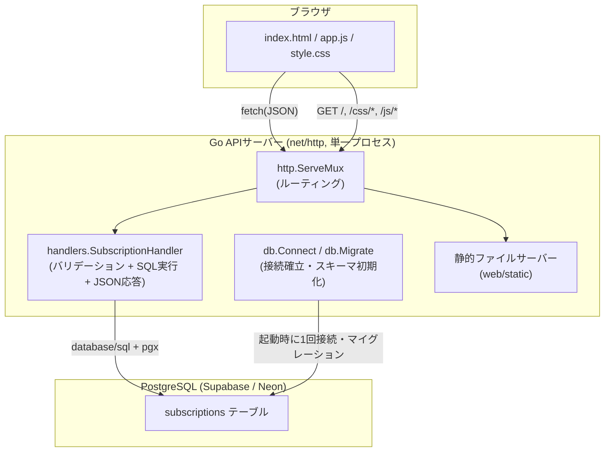
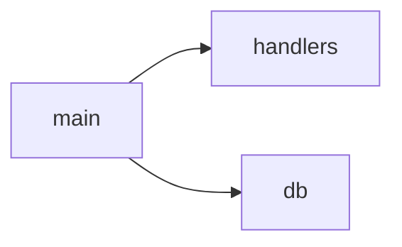
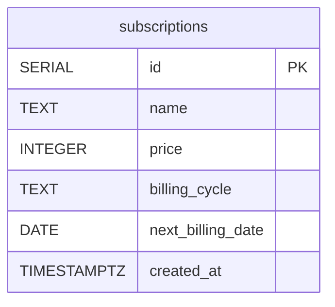
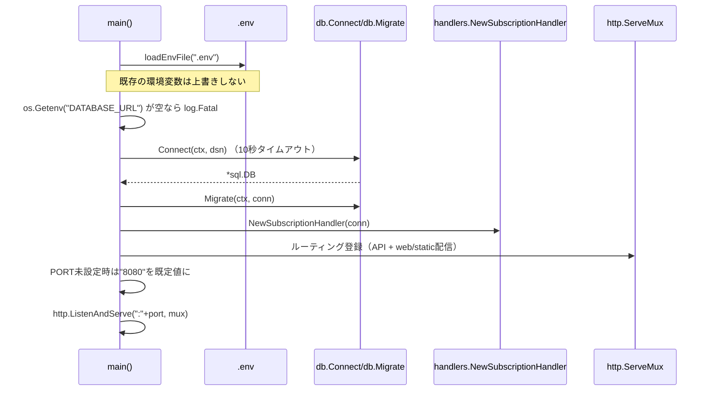
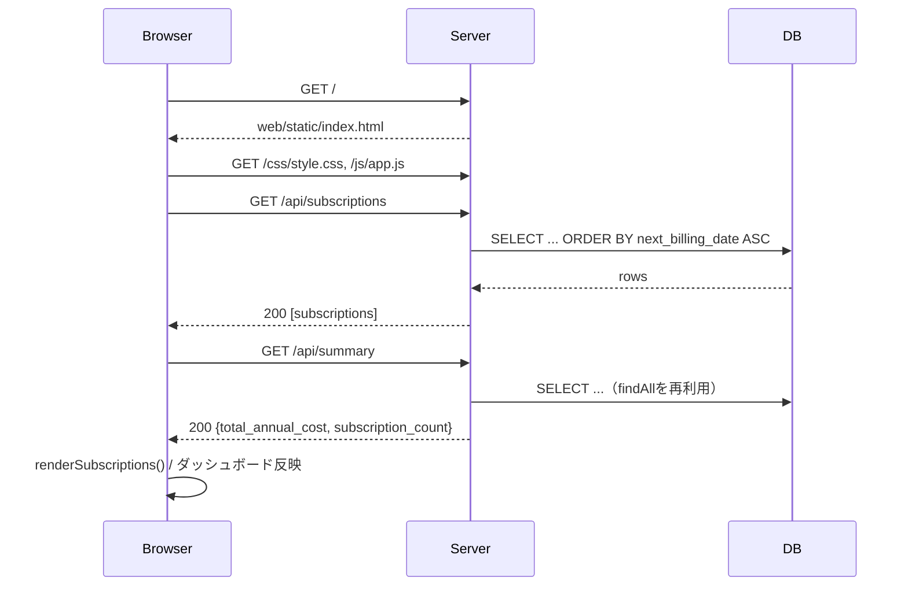
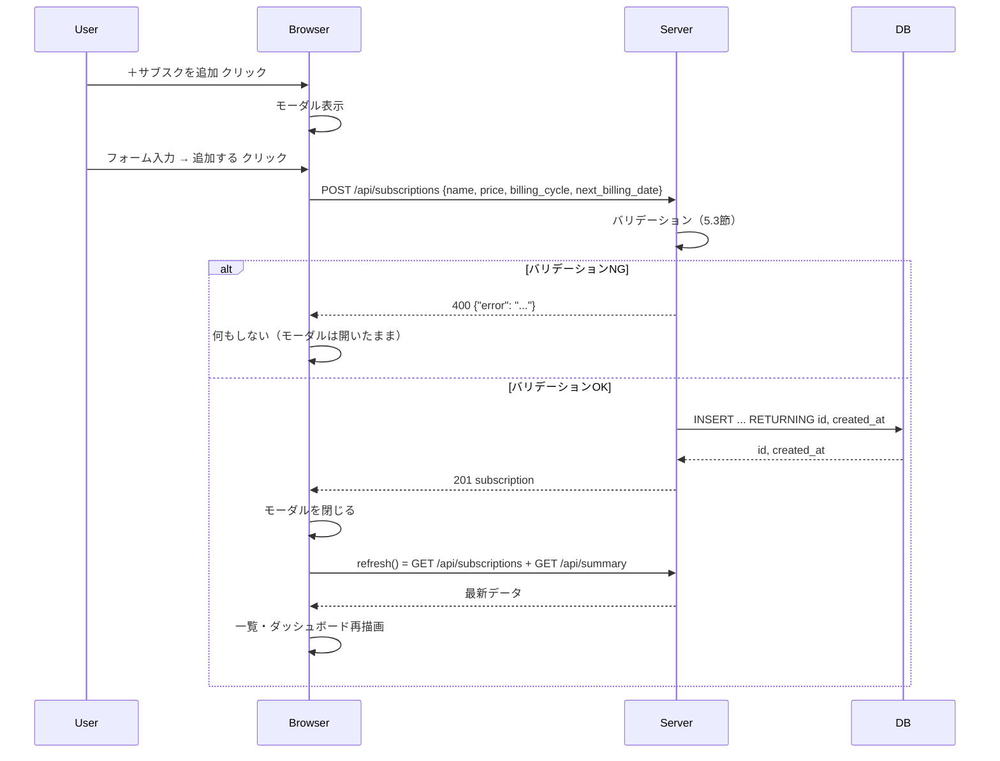
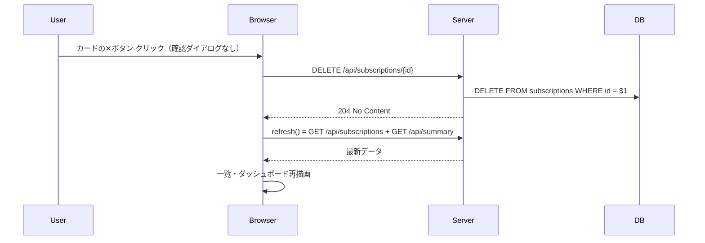

# PocketSub 設計書

本書は [requirements.md](./requirements.md)（要件定義書）および [specification.md](./specification.md)（仕様書）を実装可能なレベルまで詳細化した設計書である。
本書のみを読めば、追加の前提知識なしに実装・改修を進められることを目標とする。

対象読者: 本プロジェクトの実装・保守を行う開発者（自分自身を含む）。

> **改訂履歴**: 当初は `handler` / `repository` / `model` を分離した3層構成で設計していたが、個人開発の規模（単一テーブル・単一エンティティ）に対して層が過剰であったため、`internal/db`（DB接続）と `internal/handlers`（CRUD処理を含むHTTPハンドラー）の2層構成に簡素化した。本書はこの簡素化後の構成を正としている。

## 目次

1. アーキテクチャ設計
2. パッケージ構成と依存関係
3. データベース詳細設計
4. `internal/handlers` 詳細設計（型定義・計算ロジック・CRUD処理）
5. API詳細設計（バリデーション・エラー仕様含む）
6. 起動処理（main）詳細設計
7. フロントエンド詳細設計
8. 画面遷移・シーケンス設計
9. エラーハンドリング方針（全体）
10. 非機能設計
11. 命名規約・コーディング規約
12. テスト方針
13. 拡張性設計（将来拡張案への対応方針）

---

## 1. アーキテクチャ設計

### 1.1 全体構成

単一のGoバイナリが「静的ファイル配信」と「JSON API配信」の両方を担うモノリシック構成とする。フロントエンドはSPAフレームワークを使わず、`fetch` によるノーリロード更新のみを行う軽量なMPA+Ajax構成とする。



### 1.2 レイヤー構成と責務分離

`model` / `repository` を独立パッケージに分けず、以下の2層に簡素化する。個人開発・単一テーブル規模ではレイヤーを増やすほど「どこに何を書くか」の判断コストが増えるため、責務は分離しつつも**物理的なパッケージ分割は最小限**にする方針とする。

| レイヤー | パッケージ | 責務 | 依存してよい相手 |
|---|---|---|---|
| プレゼンテーション + 永続化 | `internal/handlers` | HTTPリクエストのパース、入力バリデーション、SQL発行、ドメイン計算（年間コスト・残日数）、JSONレスポンス生成 | `database/sql`（標準ライブラリ） |
| インフラ | `internal/db` | DB接続確立、スキーマ初期化 | なし |
| 起動 | `main`（`cmd/pocket-sub`） | 各層の初期化・DI・ルーティング登録・環境変数読込 | `internal/db`, `internal/handlers` |

依存方向は必ず `main → handlers → db` の一方向とする（`handlers` は `*sql.DB` を受け取って直接クエリを発行し、`db` パッケージの型に依存しない）。

`internal/handlers/subsc.go` 内では、以下の3つの責務をファイル内の関数・メソッド分割で明確に分ける（パッケージは1つでも、関数単位の責務は曖昧にしない）。

1. **型定義・純粋な計算ロジック**: `Subscription` 構造体、`calculateAnnualCost`、`calculateDaysUntilRenewal`（他に依存しない純粋関数）
2. **HTTPハンドラー**: `List` / `Create` / `Delete` / `Summary`（リクエストのパース・バリデーション・レスポンス整形）
3. **DBアクセス**: `findAll` / `create`（`SubscriptionHandler` の非公開メソッドとしてSQLを発行）

### 1.3 データフロー方針

- フロントエンドはアプリケーションの状態（サブスク一覧・集計値）を一切保持しない。DOMは常にAPIレスポンスから再構築する「サーバーが単一の真実源（Single Source of Truth）」方式とする。
- 追加・削除操作後は、楽観的UI更新を行わず、必ず `GET /api/subscriptions` と `GET /api/summary` を再取得してから画面を再描画する（`refresh()` 関数に集約）。これにより表示とDBの不整合を防ぐ。

---

## 2. パッケージ構成と依存関係

```
PocketSub/
├── docs/
│   ├── requirements.md
│   ├── specification.md
│   └── design.md                       # 本書
├── cmd/
│   └── pocket-sub/
│       └── main.go                     # エントリーポイント・DI・ルーティング
├── internal/
│   ├── db/
│   │   └── db.go                       # DB接続・マイグレーション
│   └── handlers/
│       └── subsc.go                    # 型定義・計算ロジック・CRUDハンドラー
├── web/
│   └── static/
│       ├── index.html
│       ├── css/style.css
│       └── js/app.js
├── .env.example
├── go.mod
└── readme.md
```



ファイル名は本プロジェクトの規約に従い、すべて小文字ケバブケースで統一する（例: `pocket-sub`, `db.go`, `subsc.go`, `index.html`, `style.css`）。

---

## 3. データベース詳細設計

### 3.1 ER図

本アプリは単一テーブル構成であり、テーブル間のリレーションは存在しない。



### 3.2 DDL

```sql
CREATE TABLE IF NOT EXISTS subscriptions (
    id SERIAL PRIMARY KEY,
    name TEXT NOT NULL,
    price INTEGER NOT NULL CHECK (price >= 0),
    billing_cycle TEXT NOT NULL CHECK (billing_cycle IN ('monthly', 'yearly')),
    next_billing_date DATE NOT NULL,
    created_at TIMESTAMPTZ NOT NULL DEFAULT now()
);
```

`internal/db/db.go` の `schema` 定数として定義し、`Migrate` 関数がサーバー起動時に毎回 `CREATE TABLE IF NOT EXISTS` を実行する（冪等なDDLのみを許可する）。

### 3.3 カラム設計の意図

| カラム名 | 型 | 制約 | 設計意図 |
|---|---|---|---|
| id | SERIAL | PRIMARY KEY | 単純な連番でよく、UUIDのような分散生成の必要がない（単一DB・単一ユーザー前提のため）|
| name | TEXT | NOT NULL | 長さ上限を設けない。サービス名は可変長かつ短文のためVARCHARの上限管理コストを避ける |
| price | INTEGER | NOT NULL, CHECK (price >= 0) | 円単位の整数管理とし、小数（銭単位）は扱わない。負の値をDB制約レベルで防止し、アプリ層のバリデーション漏れに対する最終防衛線とする |
| billing_cycle | TEXT | NOT NULL, CHECK IN ('monthly','yearly') | ENUM型ではなくTEXT+CHECK制約とすることで、将来的な値追加（例: 'weekly'）時にマイグレーション（`ALTER TYPE`）が不要になる |
| next_billing_date | DATE | NOT NULL | 時刻情報は不要なためDATE型とし、タイムゾーン起因のズレを排除する |
| created_at | TIMESTAMPTZ | NOT NULL DEFAULT now() | 登録順ソートや将来の監査用途に備えて自動付与する |

### 3.4 インデックス方針

現状、想定データ量は個人利用規模（数十件）のため、`id` の主キーインデックス以外は追加しない。一覧取得は `ORDER BY next_billing_date ASC` の全件ソートで十分な性能が出る規模であり、インデックス追加によるメリットよりも設計の単純さを優先する。将来的にデータ量が増加した場合は `CREATE INDEX idx_subscriptions_next_billing_date ON subscriptions (next_billing_date);` の追加を検討する。

### 3.5 マイグレーション戦略

専用マイグレーションツール（golang-migrate等）は導入せず、`internal/db/db.go` 内の `CREATE TABLE IF NOT EXISTS` をサーバー起動時に毎回実行する方式とする。テーブル定義を変更する場合は `schema` 定数のDDLを直接書き換える（既存カラムの変更・削除を伴う修正時は既存データの扱いに注意する）。

---

## 4. `internal/handlers` 詳細設計

`internal/handlers/subsc.go` に、型定義・計算ロジック・HTTPハンドラー・DBアクセスをすべて集約する。

### 4.1 型定義

```go
const (
    billingCycleMonthly = "monthly"
    billingCycleYearly  = "yearly"
)

type Subscription struct {
    ID               int64     `json:"id"`
    Name             string    `json:"name"`
    Price            int       `json:"price"`
    BillingCycle     string    `json:"billing_cycle"`
    NextBillingDate  time.Time `json:"next_billing_date"`
    CreatedAt        time.Time `json:"created_at"`
    AnnualCost       int       `json:"annual_cost"`        // 計算値（DBには保存しない）
    DaysUntilRenewal int       `json:"days_until_renewal"` // 計算値（DBには保存しない）
}
```

`AnnualCost` と `DaysUntilRenewal` はDBに永続化しない導出値である。取得の都度、リクエスト時刻を基準に再計算することで、日付経過によるキャッシュ不整合を構造的に防止する。

### 4.2 計算ロジック（純粋関数）

#### `calculateAnnualCost(s Subscription) int`

| 支払いサイクル | 計算式 |
|---|---|
| monthly | `price * 12` |
| yearly | `price`（そのまま） |

#### `calculateDaysUntilRenewal(s Subscription, now time.Time) int`

- `now` と `NextBillingDate` の両方を時刻情報を切り捨てた日付（0時0分0秒）に正規化した上で差分日数を計算する。これにより「当日中のどの時刻にAPIを呼んでも同じ日数が返る」ことを保証する。
- 戻り値は負数になり得る（更新日を過ぎている場合）。フロントエンド側は負数を「0日以内」＝赤ステータス扱いとして描画する（`days <= 3` の条件に含まれるため追加実装は不要）。

#### `withComputedFields(s Subscription) Subscription`

上記2つの計算結果を `Subscription` にセットして返すヘルパー。DBから取得した直後・INSERT直後の両方でこの関数を通すことで、計算漏れを防ぐ。

これら3関数は他の型・パッケージに依存しない純粋関数（`now` を引数で受け取る `calculateDaysUntilRenewal` を除き副作用なし）とし、テストしやすさを優先する（12章参照）。

### 4.3 `SubscriptionHandler`（HTTPハンドラー + DBアクセス）

```go
type SubscriptionHandler struct {
    db *sql.DB
}

func NewSubscriptionHandler(db *sql.DB) *SubscriptionHandler

func (h *SubscriptionHandler) List(w http.ResponseWriter, r *http.Request)
func (h *SubscriptionHandler) Create(w http.ResponseWriter, r *http.Request)
func (h *SubscriptionHandler) Delete(w http.ResponseWriter, r *http.Request)
func (h *SubscriptionHandler) Summary(w http.ResponseWriter, r *http.Request)

func (h *SubscriptionHandler) findAll(ctx context.Context) ([]Subscription, error)
func (h *SubscriptionHandler) create(ctx context.Context, s Subscription) (Subscription, error)
```

`findAll` / `create` は非公開メソッドとし、`List` / `Create` / `Summary` から呼び出す（`Summary` も `findAll` を再利用して合算する。専用の集計SQLを持たない理由は5.4節を参照）。

### 4.4 各メソッドの処理仕様

| メソッド | SQL | 補足処理 |
|---|---|---|
| `findAll` | `SELECT id, name, price, billing_cycle, next_billing_date, created_at FROM subscriptions ORDER BY next_billing_date ASC` | 取得した各行に `withComputedFields` を適用してから返す。結果が0件でも `nil` ではなく空スライス `[]Subscription{}` を返す（JSONで `null` ではなく `[]` を返すため） |
| `create` | `INSERT INTO subscriptions (...) VALUES (...) RETURNING id, created_at` | `RETURNING` でDB側採番のIDと `created_at` を1回の往復で取得し、`withComputedFields` を適用して返す |
| `Delete`（ハンドラー内で直接 `db.ExecContext`） | `DELETE FROM subscriptions WHERE id = $1` | 対象IDが存在しない場合もSQL自体はエラーにならない（0行削除）。204を返す仕様のため、存在確認は行わない（冪等な削除として扱う） |

### 4.5 SQLインジェクション対策

すべてのクエリでプレースホルダ（`$1`, `$2`, ...）を使用し、文字列結合によるクエリ組み立てを禁止する（要件定義書 6.3 に対応）。

### 4.6 トランザクション方針

本アプリの操作は単一テーブルに対する単発のINSERT/DELETE/SELECTのみであり、複数テーブルにまたがる整合性維持が不要なため、明示的なトランザクション（`sql.Tx`）は使用しない。

---

## 5. API詳細設計

すべて `Content-Type: application/json`。

### 5.1 ルーティング一覧

| メソッド | パス | ハンドラー関数 |
|---|---|---|
| GET | `/api/subscriptions` | `SubscriptionHandler.List` |
| POST | `/api/subscriptions` | `SubscriptionHandler.Create` |
| DELETE | `/api/subscriptions/{id}` | `SubscriptionHandler.Delete` |
| GET | `/api/summary` | `SubscriptionHandler.Summary` |
| GET | `/`, `/css/*`, `/js/*` | `http.FileServer(http.Dir("web/static"))`（`index.html` を含めすべて `web/static` 配下を直接配信） |

ルーティングは Go 1.22 以降の `http.ServeMux` のメソッド付きパターン（`"GET /api/subscriptions"` 等）とパスパラメータ（`{id}`）機能を使用し、外部ルーティングライブラリを導入しない。

### 5.2 共通レスポンスヘルパー

```go
func writeJSON(w http.ResponseWriter, status int, v interface{})
func writeError(w http.ResponseWriter, status int, message string)
```

エラー時は `{"error": "日本語メッセージ"}` 形式に統一する。

### 5.3 バリデーションルール一覧

| 対象 | 条件 | 違反時のステータス／メッセージ |
|---|---|---|
| リクエストボディ全体 | JSONとしてパース可能であること | `400` `"リクエストの形式が不正です"` |
| name | 空文字でないこと | `400` `"サービス名と料金は必須です"` |
| price | `0` 以上であること | `400` `"サービス名と料金は必須です"` |
| billing_cycle | `"monthly"` または `"yearly"` のいずれかであること | `400` `"支払いサイクルは monthly か yearly を指定してください"` |
| next_billing_date | `YYYY-MM-DD` 形式でパース可能であること | `400` `"次回更新日の形式が不正です (YYYY-MM-DD)"` |
| id（DELETE時のパスパラメータ） | `int64` としてパース可能であること | `400` `"IDの形式が不正です"` |

バリデーションは上から順に評価し、最初に違反した項目のメッセージのみを返す（複数エラーの同時返却は行わない）。

### 5.4 GET /api/subscriptions

**成功レスポンス 200**
```json
[
  {
    "id": 1,
    "name": "Netflix",
    "price": 1490,
    "billing_cycle": "monthly",
    "next_billing_date": "2026-09-25T00:00:00Z",
    "created_at": "2026-01-10T09:00:00Z",
    "annual_cost": 17880,
    "days_until_renewal": 9
  }
]
```
登録0件の場合は `[]` を返す（`null` ではない）。

### 5.5 POST /api/subscriptions

**リクエスト**
```json
{
  "name": "Netflix",
  "price": 1490,
  "billing_cycle": "monthly",
  "next_billing_date": "2026-09-25"
}
```

| ステータス | 条件 | ボディ |
|---|---|---|
| 201 | バリデーション成功・DB登録成功 | 登録済みサブスク（5.4と同形式） |
| 400 | 5.3のいずれかに違反 | `{"error": "..."}` |
| 500 | DBエラー | `{"error": "サブスクリプションの登録に失敗しました"}` |

### 5.6 DELETE /api/subscriptions/{id}

| ステータス | 条件 | ボディ |
|---|---|---|
| 204 | 削除成功（対象が存在しなくても204） | なし |
| 400 | idが数値としてパース不可 | `{"error": "IDの形式が不正です"}` |
| 500 | DBエラー | `{"error": "サブスクリプションの削除に失敗しました"}` |

### 5.7 GET /api/summary

**成功レスポンス 200**
```json
{
  "total_annual_cost": 42800,
  "subscription_count": 5
}
```

`findAll` の結果を再利用して `AnnualCost` を合算する（専用の集計SQLを持たない。理由は3.4節・4.4節と同様、想定データ量の小ささとロジック重複回避を優先するため）。

---

## 6. 起動処理（main）詳細設計

`cmd/pocket-sub/main.go` の初期化シーケンス:



### 6.1 `loadEnvFile` の仕様

- 指定パス（`.env`）が存在しない場合は何もせず正常終了する（本番環境では環境変数を直接注入する運用を想定するため、ファイル不在をエラーにしない）。
- 各行を `=` で最大2分割し、キーと値の前後空白を除去する。
- 空行および `#` で始まるコメント行はスキップする。
- **既にOS環境変数として設定済みのキーは上書きしない**（`os.LookupEnv` で存在確認してから `os.Setenv`）。これにより本番環境の環境変数がローカルの `.env` によって意図せず上書きされることを防ぐ。

### 6.2 必須環境変数チェック

`DATABASE_URL` が空文字の場合は `log.Fatal` でプロセスを即時終了する（フェイルファスト。中途半端な状態でリクエストを受け付けない）。

---

## 7. フロントエンド詳細設計

### 7.1 静的ファイル配信方式

`web/static` 配下（`index.html` / `css/style.css` / `js/app.js`）を `http.FileServer(http.Dir("web/static"))` でルート直下（`/`）にそのまま配信する。`http.FileServer` は `/` へのアクセス時に自動的に `index.html` を返すため、専用のハンドラー登録は不要。CSS/JSの参照パスは `/static/...` プレフィックスなしの `/css/style.css`, `/js/app.js` とする。

### 7.2 画面構成（`web/static/index.html`）

```
┌─────────────────────────────────────────────┐
│ Header: "PocketSub"          [＋ サブスクを追加] │
├─────────────────────────────────────────────┤
│ ┌───────────────────┐ ┌───────────────────┐ │
│ │ 年間合計コスト        │ │ 登録件数            │ │ ← ダッシュボード（2カード）
│ │ ¥42,800            │ │ 5件                 │ │
│ └───────────────────┘ └───────────────────┘ │
├─────────────────────────────────────────────┤
│ [カード][カード][カード]                        │ ← サブスク一覧（グリッド）
│ [カード][カード]        （0件時は空メッセージ）    │
└─────────────────────────────────────────────┘
        (＋ボタン押下時にモーダルをオーバーレイ表示)
```

### 7.3 DOM要素とスクリプトの対応表

| DOM ID | 役割 |
|---|---|
| `#subscription-list` | サブスクカードを描画するコンテナ（`innerHTML` を都度クリアして再構築） |
| `#empty-message` | 一覧0件時のみ表示するプレースホルダー |
| `#total-annual-cost` / `#subscription-count` | ダッシュボードの数値表示 |
| `#modal-overlay` | 追加モーダルのオーバーレイ（`hidden` / `flex` クラスの付け替えで表示制御） |
| `#subscription-form` | 追加フォーム（`FormData` でシリアライズしてPOST） |
| `#open-modal-button` / `#close-modal-button` | モーダルの開閉トリガー |

### 7.4 状態管理方針

グローバルなアプリケーション状態変数（配列や集計値をJS変数として保持する設計）は持たない。すべての表示更新は「APIを呼ぶ→レスポンスをそのままDOMに変換する」直接反映方式とし、フロントエンドに状態のズレが生じる余地をなくす（1.3節参照）。

### 7.5 関数責務一覧（`web/static/js/app.js`）

| 関数 | 責務 |
|---|---|
| `renewalStatus(days)` | 残日数からラベル文字列とTailwindクラス名を決定する純粋関数（7.6節のルールを実装） |
| `formatYen(amount)` | `¥` + 3桁区切りの通貨表示フォーマット |
| `renderSubscriptions(subscriptions)` | 一覧データからカードDOMを構築し `#subscription-list` に反映。各カードの削除ボタンに `deleteSubscription` をバインド |
| `loadSubscriptions()` | `GET /api/subscriptions` を呼び `renderSubscriptions` に渡す |
| `loadSummary()` | `GET /api/summary` を呼びダッシュボード表示を更新 |
| `deleteSubscription(id)` | `DELETE /api/subscriptions/{id}` を呼び、完了後 `refresh()` |
| `refresh()` | `loadSubscriptions` と `loadSummary` を `Promise.all` で並列実行 |
| フォームの `submit` イベントハンドラ | `FormData` → JSONペイロード変換、`POST /api/subscriptions`、成功時はモーダルを閉じて `refresh()` |

### 7.6 更新日ステータスの表示ルール

| 残り日数 | ラベル | Tailwindクラス |
|---|---|---|
| 3日以下（負数含む） | `あと${days}日` | `bg-red-100 text-red-700` |
| 4〜7日 | `あと${days}日` | `bg-amber-100 text-amber-700` |
| 8日以上 | `あと${days}日` | `bg-emerald-100 text-emerald-700` |

判定は `days <= 3` → `days <= 7` → それ以外、の順で評価する（`renewalStatus` 関数）。

### 7.7 バリデーションの責務分担

フォームの必須入力チェックはHTML標準の `required` 属性・`type="number" min="0"`・`type="date"` によるブラウザ側の一次チェックのみを行い、業務ルールとしての正式なバリデーションはサーバー側（5.3節）に一元化する。フロントエンドはサーバーからの `400` エラーの詳細メッセージを個別に画面表示する機構を持たない（`response.ok` の真偽のみで分岐し、失敗時は何もしない）。将来UX改善する場合は、エラーメッセージ表示用のUI要素追加が拡張ポイントとなる（13章参照）。

---

## 8. 画面遷移・シーケンス設計

### 8.1 初期表示



### 8.2 サブスク追加



### 8.3 サブスク削除



---

## 9. エラーハンドリング方針（全体）

| レイヤー | 方針 |
|---|---|
| `internal/db` | 接続失敗・マイグレーション失敗は起動時に `log.Fatal` でプロセスを終了する（不完全な状態で稼働させない） |
| `internal/handlers`（DBアクセス部） | SQLエラーはラップせずそのまま呼び出し元（ハンドラーメソッド）に返す |
| `internal/handlers`（HTTP処理部） | すべてのエラーを `400`（クライアント起因）または `500`（サーバー内部）に分類し、`{"error": "日本語メッセージ"}` 形式で返す。内部エラーの詳細（SQLエラー内容やスタックトレース）はレスポンスに含めない（情報漏洩防止）。サーバーログには `log` パッケージで実際のエラー内容を出力する運用を推奨する |
| フロントエンド | `response.ok` で成功/失敗を判定。失敗時のユーザー向けエラー表示は現状スコープ外（13章の拡張ポイント） |

---

## 10. 非機能設計

### 10.1 セキュリティ

- `DATABASE_URL` は `.env`（`.gitignore` 対象）またはホスティング環境の環境変数で管理し、リポジトリにコミットしない。
- 全SQLはプレースホルダ（`$1`, `$2`, ...）を使用し、文字列結合によるクエリ生成を行わない。
- 認証・認可機構は実装しない（要件定義書7章の制約に基づく単一ユーザー前提）。将来的に複数ユーザー対応する場合は、`subscriptions` テーブルへの `user_id` カラム追加と、全クエリへのWHERE条件追加、認証ミドルウェアの追加が必要になる。

### 10.2 パフォーマンス

- 想定データ量（個人利用・数十件規模）を前提とし、キャッシュ層・ページネーションは導入しない。
- `Summary` は専用集計SQLではなく `findAll` の結果を再利用する設計とし、シンプルさを優先する（4.4節・5.7節参照）。データ量が数千件規模に増加した場合は `SELECT SUM(...)` へのSQLレベル集計への切り替えを検討する。

### 10.3 可用性・デプロイ構成

- ローカル環境および無料枠のマネージドPostgreSQL（Supabase / Neon等）上での稼働を前提とする。
- サーバープロセスは単一インスタンス構成とし、水平スケーリングやロードバランシングは考慮しない。
- ヘルスチェック用エンドポイントは現状持たない（将来的にホスティング先がヘルスチェックを要求する場合は `GET /healthz` の追加を検討）。

### 10.4 ロギング

- 標準の `log` パッケージのみを使用し、構造化ロギング（JSON logger等）は導入しない。起動時のログ（サーバー起動、致命的エラー）のみを出力し、リクエスト単位のアクセスログは出力しない（個人利用規模のため必要性が低い）。

---

## 11. 命名規約・コーディング規約

プロジェクト全体で以下を厳守する（`CLAUDE.md` 準拠）。

- **ファイル名**: 小文字ケバブケース（例: `pocket-sub`, `db.go`, `subsc.go`, `index.html`, `style.css`）
- **コードコメント**: 日本語で記述する（Go・JS共通）。コメントは「なぜそうしたか」を書き、コードを読めば分かる内容は書かない
- **Go識別子**: パッケージ内はGo標準の命名規則（`PascalCase` for exported, `camelCase` for unexported）に従う。ファイル名のケバブケースとGo識別子の命名規則は独立したルールとして扱う
- **JSON フィールド名**: `snake_case`（例: `billing_cycle`, `next_billing_date`, `annual_cost`）。DBカラム名と1対1で対応させ、変換の複雑さを避ける
- **HTTPステータスコードの使い分け**: クライアント起因は `4xx`、サーバー起因は `5xx` を厳格に使い分ける（5.3節・9章参照）

---

## 12. テスト方針

現時点で自動テストは未実装だが、実装・改修時に優先して単体テストを追加すべき対象を以下に定義する。

### 12.1 優先度高（計算ロジック）

`internal/handlers/subsc.go` 内の `calculateAnnualCost` / `calculateDaysUntilRenewal` は外部依存（DB・HTTP）がなく、純粋関数として最もテストしやすい。パッケージ内テスト（`internal/handlers/subsc_test.go`、同一パッケージの非公開関数として直接呼び出す）として追加する。

| テスト対象 | ケース |
|---|---|
| `calculateAnnualCost` | monthlyで `price*12` になること／yearlyで `price` のままになること／`price=0` で `0` になること |
| `calculateDaysUntilRenewal` | 当日が更新日の場合に `0` を返すこと／未来日で正の値／過去日（更新日超過）で負の値を返すこと／時刻部分（時分秒）が異なっていても日付のみで計算されること |

### 12.2 優先度中（HTTPハンドラー）

`httptest.NewRecorder` と `sqlmock`（`go-sqlmock` 等）でDBをモック化し、`SubscriptionHandler` の `Create` を中心に5.3節のバリデーション表の各行を1テストケースとして網羅する。特に以下の境界値を重視する。

- `price = -1`（拒否）と `price = 0`（許可）の境界
- `billing_cycle` に `"weekly"` 等の未対応値を渡した場合の拒否
- `next_billing_date` に不正フォーマット（例: `"2026/09/25"`）を渡した場合の拒否

### 12.3 優先度低（DBアクセス）

実DB（テスト用PostgreSQLコンテナ等）を用いた結合テスト。個人開発の規模では省略可だが、将来CI導入時は `docker compose` によるテスト用DB起動を前提としたテスト追加を検討する。

---

## 13. 拡張性設計（将来拡張案への対応方針）

要件定義書9章の将来拡張案に対し、現設計がどこまで対応可能かを整理する。

| 拡張案 | 現設計への影響と対応方針 |
|---|---|
| 更新日が近いサブスクのメール通知 | `calculateDaysUntilRenewal`（4.2節）をそのまま再利用可能。バッチ処理（cron等）から `internal/handlers` の `findAll` 相当のクエリを呼び出し、しきい値以下のものを抽出してメール送信する処理を別コマンド（例: `cmd/notifier`）として追加する構成が既存構造と親和性が高い |
| カテゴリ別集計 | `subscriptions` テーブルに `category TEXT` カラムを追加し、`Subscription` 構造体にフィールド追加、`findAll`/`create` のSQLにカラムを追加する。既存のCHECK制約方式（3.3節参照）と同様に `CHECK (category IN (...))` での運用も可能 |
| 支出推移のグラフ表示 | 現テーブルには「価格改定履歴」を保持する仕組みがないため、`price_history` テーブル（サブスクID・変更日・金額）の新設が必要。既存の2層構造（handlers/db）を維持したまま新規エンティティ用のハンドラーファイル（例: `internal/handlers/price-history.go`）を追加できる |
| 複数ユーザー対応 | 10.1節の通り、`user_id` カラム追加・認証ミドルウェア追加・全クエリへのフィルタ条件追加が必要。影響範囲が最も広い拡張であり、この段階で `internal/handlers` 内のSQLが肥大化するようであれば、当初検討していた `repository` 層の分離を再導入することを推奨する |

いずれの拡張も、現在の「main → handlers → db」の一方向依存構造（1.2節）を崩さずに追加できるよう設計してある。新機能追加時は、この依存方向を破らないことを設計レビューの基準とする。
